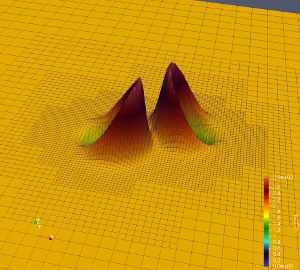
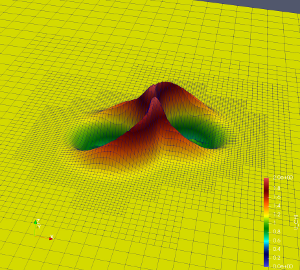
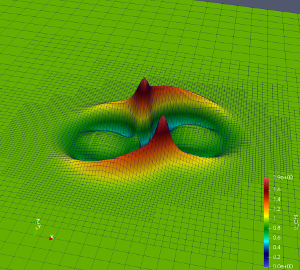
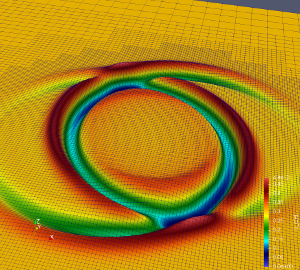

<span style="font-family:Papyrus; font-size:4em;">-GR</span>

## What is Dendro-GR ?

Dendro-GR is a highly-scalable framework that targets problems of interest to numerical relativity and broader astrophysics communities. This framework combines a parallel octree-refined adaptive mesh (i.e., Dendro library) with a wavelet adaptive multiresolution and a physics module to solve the Einstein equations of general relativity. The goal of this work is to perform advanced, massively parallel numerical simulations of binary black holes with mass ratios on the order of 100:1. These studies will be used to generate waveforms as used in LIGO data analysis and to calibrate semi-analytical approximate methods. Our framework consists of a distributed memory octree-based adaptive meshing framework in conjunction
with a node-local code generator. Dendro-GR framework achieves excellent performance and scalability on modern leadership architectures. Dendro-GR also has tested strong scalability up to 8 A100s and weak scaling up to [229,376](https://www.tacc.utexas.edu/-/texascale-days-pushing-scientific-software-to-new-heights) x86 cores on the Texas Advanced Computing Center’s Frontera system. To the best of our knowledge, Dendro-GR work is the first highly scalable, adaptive, multi-GPU numerical relativity code performing binary black hole mergers.


***
## Get Dendro-GR
Dendro framework is an open-source scalable octree algorithms suite, designed to solve partial differential equations using Galerkin, finite difference, and finite volume discretization methods. If you are interested in using Dendro please let us know how can we help. You can clone the repository using, 

* Get Dendro-5.01 : `git clone https://github.com/paralab/Dendro-5.01.git`
* To clone this repository  : `git clone https://github.com/paralab/sc22-dgr.git` 

## Code generation dependencies
`pip3 install --user sympy numpy numba git+https://github.com/moble/quaternion git+https://github.com/moble/spherical_functions cogapp quadpy`

## How to build Dendro-GR?

To build Dendro-5.0, you need the following external packages, 
* C/C++11 or higher, (tested with GNU and Intel compilers)
* MPI implementation (tested with mvapich2, openmpi, and intel compilers)
* BLAS/LAPACK (tested with openBLAS and Intel MKL)
* GSL, need to set `GSL_ROOT_DIR` to cmake to auto-detect GSL library.
* Python packages for code generation, `pip3 install --user sympy numpy numba git+https://github.com/moble/quaternion git+https://github.com/moble/spherical_functions cogapp quadpy`
* PETSc if building with FEM (CG/DG) support. 

To build the code please use the following commands. Please set the following environment variables. 
* `export CC=<command for C compiler suite>`
* `export CXX=<command for C++ compiler suite>`
* `export GSL_ROOT_DIR=<GSL home directory>`
* For scalability experiments please set the following CMake flags `-DBSSN_DISABLE_INITIAL_GRID_REFINEMENT=ON` and `-DBSSN_PROFILE_SCALING_RUN=ON`
* `-DWITH_CUDA=ON` build code for both CPU and GPU. Note that for GPU solvers you will need to set `-DOCT2BLK_COARSEST_LEV=31`. The above flag will create a sequence of patches with a single octant per patch.
* The above will build targets in `<source dir>/<build dir>/BSSN_GR` folder.
* For production runs please configure CMake with `cmake -DWITH_CUDA=ON -DOCT2BLK_COARSEST_LEV=31 ../` for GPUs. 

```
$cd <path to root source dir >
$ mkdir build
$ cd build
$ cmake -DBSSN_DISABLE_INITIAL_GRID_REFINEMENT=ON -DBSSN_PROFILE_SCALING_RUN=ON -DWITH_CUDA=ON -DOCT2BLK_COARSEST_LEV=31 ../
$ make bssnSolverCtx bssnSolverCUDA tpid bssnWSTestCUDA bssnScalingTest -j4
```

## Singularity container

The singularity container definition file is provided in the repository under the folder `container`. The following command can be used to build the Dendro-GR container which installs all the required dependencies and compile the Dendro-GR code.

```
sudo singularity build --sandbox dgr-cuda dgr.def
singularity run dgr-cuda dgr.def
```
## Running experiments

### GPU and CPU experiments

Additional scripts files for conducted experiments are presented in the `<source dir>/BSSN_GR/experiment_scripts/ls6` folder. 
*  `q1-ss` : GPU/CPU strong scaling experimental SLURM scripts and parameter files.
*  `q1-ws` : GPU weak scaling experimental SLURM scripts and parameter files.

Executables for the CPU/GPU scaling experiments can be summarized as follows. 
*  `bssnWSTestCUDA` : Weak scaling study on GPUs.
*  `bssnScalingTest` : Weak scaling study on CPUs.
*  `bssnSolverCtxCUDA` : Strong scaling study on GPUs.
*  `bssnSolverCtx` : Strong scaling study on CPUs. 

You can run the above scaling tests as follows. 
*  Weak scaling: The user can set the `BSSN_DENDRO_GRAIN_SZ` variable in the parameter file to control the approximate number of octants per core to be used in the weak scalability study. Please use the parameter file [q1_ws.par.json](BSSN_GR/experiment_scripts/ls6/q1-ws/q1_ws.par.json)
   *  GPU : `mpirun -np <number of GPUs> ./BSSN GR/bssnWSTestCUDA q1_ws.par.json 1`. Set parameter in the `BSSN_DENDRO_GRAIN_SZ` to 16000, (i.e., 16000 octants per GPU).
   *  CPU : `mpirun -np <number of GPUs> ./BSSN GR/bssnScalingTest q1_ws.par.json 1`. Set parameter in the `BSSN_DENDRO_GRAIN_SZ` to 1000, (i.e., 1000 octants per CPU core).
   *  For CPU weak scaling the detailed profile output will be written in the `bssnCtx_WS_<number of CPUS>.txt` file, while for GPU runs these will be written in `bssnCtxGPU_WS_<number of CPUS>.txt` file. 
*  Strong scaling: Please use the parameter file [q1_r2.2.par.json](BSSN_GR/experiment_scripts/ls6/q1-ss/q1_r2.2.par.json)
   * CPU : `mpirun -np <number of CPUs> ./BSSN_GR/bssnSolverCtx q1_r2.2.par.json 1` . The results are written in the `bssnCtx_<number of CPUs>.txt` file created relative to the executable directory. 
   * GPU : `mpirun -np <number of GPUs> ./BSSN_GR/bssnSolverCUDA q1_r2.2.par.json 1`. The results are written in the `bssnCtxGPU_<number of CPUs>.txt` file created relative to the executable directory. 
*  The scaling experiments will create a tab-separated table, with the overall breakdown of the computation. 
*  Experiments on `Octant to Patch` and `Patch to Octant` : `make run_meshgpu_tests` to build the benchmark for padding zone computation. Note that this will built the executable in `<source dir>/build` folder. The parameters should be specified in the order and correspond to, 
   *  maximum allowed depth of the octree, tolerance value for refinement, partition tolerance (recommend to keep it at 0.1), order of interpolation for each octant (all the experiments used 6 order interpolations in the paper), flag 0 for CPU padding zone computations, flag 1 for GPU padding zone computations.
   *  CPU tests `mpirun -np <number of CPUs> ./run_meshgpu_tests 8 1e-3 0.1 6 0`
   *  GPU tests `mpirun -np <number of CPUs> ./run_meshgpu_tests 8 1e-3 0.1 6 1`

For scalability study runs please use the following to interpret the overall cost break down. All the timing results compute three statistics, minimum , mean and the maximum time across mpi ranks. 
* `step_ets` : Number of timesteps performed for the profiling run.
* `act_npes` : Active sub communicator from the global mpi communicator (for scaling runs this should match the global number of ranks). 
* `glb_npes` : Global mpi communicator size. 
* `maxdepth` : Maximum depth of the refinement used for the octree generatoin. 
* `numOcts`  : Total number of octants (i.e., across all partitions)
* `dof_cg`   : Total number of grid points (i.e., across all partitions)
* `dof_uz`   : Total number of grid points after padding (i.e., across all partitions)
* `gele_(min, mean , max)` :  (Min, mean, Max) of ghost octants across partitions. 
* `lele_(min, mean , max)` :  (Min, mean, Max) of local octants across partitions. 
* `lnodes_(min, mean, max)` :  (Min, mean, Max) of local grid points across partitions.
* `remsh_igt(min, mean, max)`: (Min, mean, Max) of re-grid runtime across partitions.
* `evolve_(min, mean, max)` :	 (Min, mean, Max) of total RK runtime for `step_ets` timesteps across partitions. For the plots presented in the paper, `evolve_max` is what is plotted in the paper for total RK runtime. 
* `unzip_async(min, mean, max)`:  (Min, mean, Max) of `octant-to-patch`  computation with overlapped communication across partitions. 
* `unzip_(min, mean, max)`: (Min, mean, Max) of `octant-to-patch`  computation without communication  across partitions. For the plots presented in the paper, `unzip` cost is the `unzip_max`. Because the MPI communication is overlapped with `octant-to-patch` computation, MPI communication `comm` cost is inferred with `comm = unzip_async_max  - unzip_max`
* `rhs_(min, mean, max)`: (Min, mean, Max) of rhs computation cost across partitions. For the plots presented in the paper, `rhs` refers to the `rhs_max`.
* `zip_async_(min, mean, max)`: (Min, mean, Max) of `patch-to-octant` cost across partitions. For the plots presented in the paper, `zip` refers to the `zip_max`.


### Running experiments with Singularity
If you built Dendro-GR with Singularity, the following command can be used to launch the main BSSN solver and other benchmarks. 
```
singularity exec dgr-cuda sc22-dgr/build_gpu/BSSN_GR/./bssnSolverCtx sc22-dgr/build_gpu/q1.par.json 1
```
By using MPI you can execute,
* When using GPUs you will need to set appropriate MPI tasks per node, to match with the number of GPUs per node.  
* For strong scalability with CPUs, run `mpirun -n <NUMBER_OF_RANKS> singularity exec dgr-cuda sc22-dgr/build_gpu/BSSN_GR/./bssnSolverCtx sc22-dgr/build_gpu/q1_r2.2.par.json 1`
* For strong scalability with GPUs, run `mpirun -n <NUMBER_OF_RANKS> singularity exec dgr-cuda sc22-dgr/build_gpu/BSSN_GR/./bssnSolverCUDA sc22-dgr/build_gpu/q1_r2.2.par.json 1`
* For GPU weak scalability, run `mpirun -n <NUMBER_OF_RANKS> singularity exec dgr-cuda sc22-dgr/build_gpu/BSSN_GR/./bssnWSTestCUDA sc22-dgr/build_gpu/q1_ws.par.json 1`
* For CPU weak scalability, run `mpirun -n <NUMBER_OF_RANKS> singularity exec dgr-cuda sc22-dgr/build_gpu/BSSN_GR/./bssnScalingTest sc22-dgr/build_gpu/q1_ws.par.json 1`

### Binary mergers and GWs
* The parameters for the applications has to be provided with .json file. Example parameter files for mass ratios 1, 2, and 4 can be found in BSSN GR/pars folder.
   * `BSSN_GR/pars/q1.par.json` : q=1 binary black hole merger
   * `BSSN_GR/pars/q2.par.json` : q=2 binary black hole merger
   * `BSSN_GR/pars/q4.par.json` : q=4 binary black hole merger
   
* Create the following folders in the relative path to the BSSN executable (or you will have to put the full paths in the parameter files used for the corresponding execution).
   * `vtu` - VTU folder where the solution is written with parallel VTU file format, in the frequency specified by the parameter file (i.e., BSSN IO OUTPUT FREQ).
   * `cp`  - Checkpoint folder where the checkpoints are stored in the frequency specified by the parameter file (i.e., BSSN CHECKPT FREQ).
   * `dat` - dat - Data files, diagnostics data on the binary. Requested modes (i.e., "BSSN GW L MODES": [2,3,4]) of the gravitational waves are extracted by the observers specified by "BSSN GW RADAII": [50,60,70,80,90,100]
   
* `tpid`: First run the tpid solver with the chosen parameter file. The above will solve the initial condition for the binary using Two puncture gauge.
* Once the tpid solver is finished, user can launch the BSSN solver bssnSolverCUDA or bssnSolverCtx for GPU and CPU versions respectively.

```
$ ./BSSN_GR/tpid q1.par.json <number of threads to use>
$ mpirun -np <number of GPUs> ./BSSN_GR/bssnSolverCUDA q1.par.json 1
```


## BSSNOK formulation

Dendro-GR consists of SymPy-based code generation framework ([SympyGR](https://github.com/paralab/SymPyGR)) that supports efficient code generation for both CPUs and GPUs. You can find the SymPy BSSNOK file [here](https://github.com/paralab/sc22-dgr/blob/main/CodeGen/bssn.py). Numerical relativity application can be quite overwhelmed for a newcomer to Dendro-GR, hence we provide a simpler `NLSigma` computation here. Note that the overall workflow of the computational is identical to solving the GR equation but with a much simpler set of equations.  

## Simple Example: Nonlinear Sigma Model (NLSigma)
NlSigma folder consists of a simple, nonlinear wave equation with adaptive mesh refinement (AMR). You can copy the parameter file from `NLSigma/par` folder and simply run `mpirun -np 8 ./NLSigma/nlsmSolver nlsm.par.json`.

| | |  |  |

You can write the equations in symbolic python which generates the C compute kernel. Look at `nlsm.py` 

```
import dendro
from sympy import *
###############################################################
#  initialize
###############################################################
r = symbols('r')
# declare functions
chi = dendro.scalar("chi","[pp]")
phi = dendro.scalar("phi","[pp]")
d = dendro.set_first_derivative('grad')    # first argument is direction
d2s = dendro.set_second_derivative('grad2')  # first 2 arguments are directions
d2 = dendro.d2

###############################################################
#  evolution equations
###############################################################

phi_rhs = sum( d2(i,i,chi)  for i in dendro.e_i ) - sin(2*chi)/r**2
chi_rhs = phi

###############################################################
#  evolution equations
###############################################################
outs = [phi_rhs, chi_rhs]
vnames = ['phi_rhs', 'chi_rhs']
dendro.generate(outs, vnames, '[pp]')
```

Which generates the code, 

```
// Dendro: {{{ 
// Dendro: original ops:  10
// Dendro: printing temp variables

// Dendro: printing variables
//--
phi_rhs[pp] = grad2_0_0_chi[pp] + grad2_1_1_chi[pp] + grad2_2_2_chi[pp] - sin(2*chi[pp])/pow(r, 2);
//--
chi_rhs[pp] = phi[pp];
// Dendro: reduced ops:  10
// Dendro: }}}

```

### Parameters for NLSigma

* Grid parameters
    * `NLSM_GRID_MIN_X`, `NLSM_GRID_MIN_Y`, `NLSM_GRID_MIN_Z`: The minimum coordinate values for the computational domain in the *x*-, *y*-, and *z-* directions.
    * `NLSM_GRID_MAX_X`, `NLSM_GRID_MAX_Y`, `NLSM_GRID_MAX_Z`: The maximum coordinate values for the computational domain in the *x*-, *y*-, and *z-* directions.

* Evolution parameters    
    * `NLSM_CFL_FACTOR`: The Courant factor used for time integration.  *dt* = `NLSM_CFL_FACTOR *` *dx*
    * `KO_DISS_SIGMA`: Coefficient for Kreiss-Oliger dissipation that is added to the solution.
    * `NLSM_RK45_TIME_BEGIN`: Initial time label for the evolution, usually this is set to 0.
    * `NLSM_RK45_TIME_END`: The final time for the evolution. The code exits when this time is reached.
    * `NLSM_RK45_TIME_STEP_SIZE`: Initial time step for the Runge-Kutta 4-5 adaptive time integrator.
    * `NLSM_RK45_DESIRED_TOL`: Tolerance for the RK4-5 adaptive time integrator.

* Output parameters
    * `NLSM_IO_OUTPUT_FREQ`: Frequency for output.  Output is written as 3D VTK files.
    * `NLSM_VTU_FILE_PREFIX`: Prefix for naming the output files.  Each processor outputs all variables to a single file labeled by the timestep.
    * `NLSM_NUM_EVOL_VARS_VTU_OUTPUT`: The number of evolution variables to be output.
    * `NLSM_VTU_OUTPUT_EVOL_INDICES`: A list of variable indices to specify which variables will be written to output. The first `NLSM_NUM_EVOL_VARS_VTU_OUTPUT` in this list are written to the output file.

* General refinement parameters
    * `NLSM_MAXDEPTH`: The maximum refinement depth for the octree. The minimum possible grid resolution is proportional to 1/2^k, where k is the maximum depth.
    * `NLSM_REMESH_TEST_FREQ`: Frequency for updating an adaptive grid.
    * `NLSM_LOAD_IMB_TOL`: Dendro load imbalance tolerance for flexible partitioning.
    * `NLSM_DENDRO_GRAIN_SZ`: Grain size N/p , Where N number of total octants, p number of active cores.  This is essentially the number of octants per core and essentially functions as a measure of the computational load per core. (Dendro does not automatically use all cores that are available in a multiprocessor run, but gives each core a minimum amount of work before adding new cores.)

* Wavelet refinement parameters
    * `NLSM_WAVELET_TOL`: The wavelet error tolerance for the solution.  Refinement is added when the estimated error in the solution, measured by the wavelet coefficient, is larger than this tolerance.
    * `NLSM_NUM_REFINE_VARS`: The number of variables used to evaluate refinement on the grid.
    * `NLSM_REFINE_VARIABLE_INDICES`: A list of variable indices to specify which variables are used to determine the grid refinement.  Wavelet coefficients will be calculated for the first `NLSM_NUM_REFINE_VARS` in this list.
    * `NLSM_DENDRO_AMR_FAC`: A factor to determine the threshold for coarsening the grid. The grid is coarsened when the wavelet coefficients are less than `NLSM_DENDRO_AMR_FAC * NLSM_WAVELET_TOL`.

* Block refinement parameters
    * `NLSM_ENABLE_BLOCK_ADAPTIVITY`: Block adaptivity provides simple fixed-mesh refinement.  The grid is refined to the maximum depth (or minimum resolution) inside a fixed region set by `NLSM_BLK_MIN_X`, `NLSM_BLK_MAX_X`, and related variables.  Set this parameter to "1" to enable block adaptivity, or "0" otherwise (default). Block adaptivity is used primarily for testing and debugging.  For example, a uniform grid can be created by specifying the maximum refinement region to cover the entire domain.
    * `NLSM_BLK_MIN_X`: The minimum *x*-coordinate for the block that is refined to the maximum depth. Same for *y*- and *z*-coordinates.
    * `NLSM_BLK_MAX_X`: The maximum *x*-coordinate for the block that is refined to the maximum depth. Same for *y*- and *z*-coordinates.

* Checkpoint parameters
    * `NLSM_RESTORE_SOLVER`: Set this parameter to "1" to read from checkpoint files, otherwise set it to "0" (default).  When checkpointing is used, the code automatically selects the latest checkpoint files for restoring the solver.
    * `NLSM_CHECKPT_FREQ`: The checkpoint frequency.
    * `NLSM_CHKPT_FILE_PREFIX`: A string prefix for naming the checkpoint files.


***


## Galerkin approximations (i.e., Finite element approaches): 
Dendro supports finite element computations, currently Continous Galerkin (CG) Methods, and Discontinuous Galerkin (DG) Methods. All FEM related code are in `FEM` folder, you can write, applications using the `feMatrix.h` and `feVector.h` classes, to represent the left and right hand sidesof the variational formulations. `oda.h` contains the interface class which enables easy integration with petsc matrix based and matrix-free methods.  

Simple Laplace equation using FEM can be found in `FEM/examples/src/heatEq.cpp` file. 


